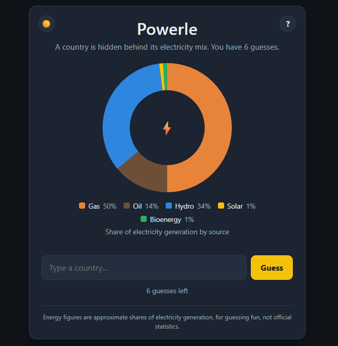

# Powerle

[](https://github.com/igor-couto/Powerle/actions/workflows/deploy.yml)

Powerle is a daily country guessing game. A hidden country is represented by its electricity generation mix, and players have six guesses to identify it.



After each guess, the game gives geographic hints:

- Distance from the guessed country to the answer
- Direction toward the answer
- Proximity score
- Whether the guess is on the same continent

The daily puzzle is deterministic, uses UTC dates, and changes for everyone at 00:00 UTC.

## Tech Stack

- .NET 10
- ASP.NET Core Blazor Server with Razor components
- Bootstrap assets
- Country dataset is a JSON file

## Getting Started

### Prerequisites

Install the .NET 10 SDK.

### Run Locally

```bash
dotnet restore
dotnet run
```

The development profile uses:

- `http://localhost:5172`
- `https://localhost:7226`


## Data Notes

The app uses `Data/countries.json` as a curated dataset of countries, coordinates, continents, and approximate electricity generation shares. The file is copied to the application output at build time but is not placed under `wwwroot`, so the daily answer is not exposed as a public static asset.

Energy figures are intended for gameplay and should not be treated as official statistics.

When adding or updating countries, keep source names aligned with `Models/EnergyPalette.cs` so chart colors and ordering remain consistent.

## How the Daily Puzzle Works

`DailyPuzzleService` shuffles the country list once using a fixed seed, then selects a country based on the number of UTC days since the configured epoch. This keeps the answer stable for all players on the same day without requiring a database.

## Development Notes

- Game state is stored in protected browser local storage for the current UTC day.
- The puzzle resets automatically when the UTC date changes.
- Guess evaluation is handled by backend service logic, separate from the Razor UI.

## Author

Feel free to get in touch with me regarding any questions or issues

* **Igor Couto** - [igor.fcouto@gmail.com](mailto:igor.fcouto@gmail.com)
